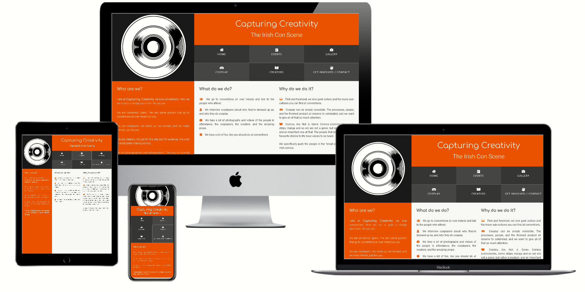
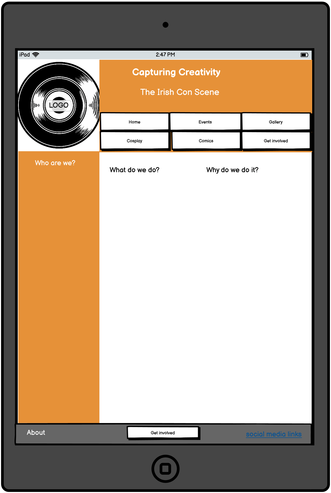
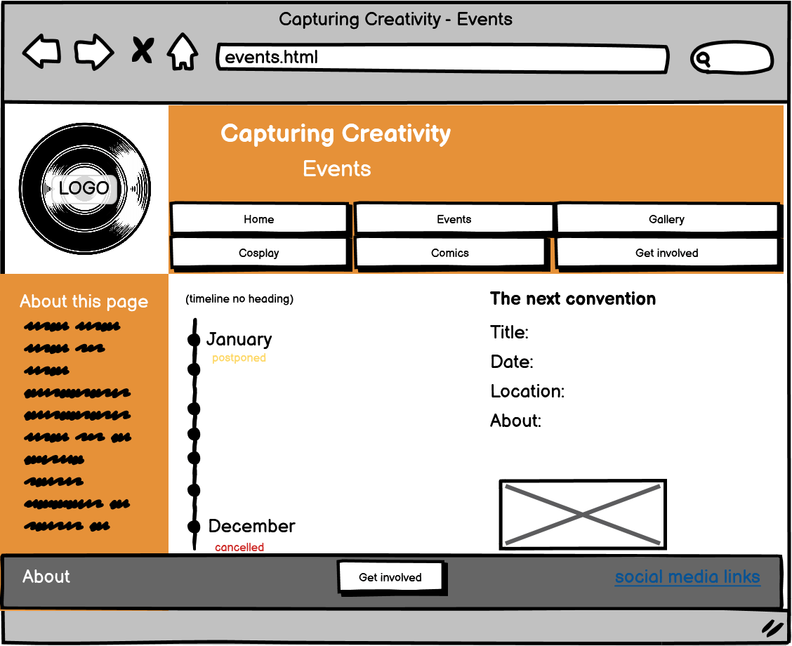
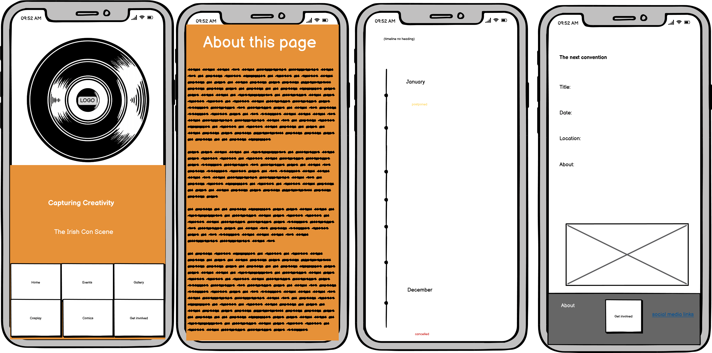
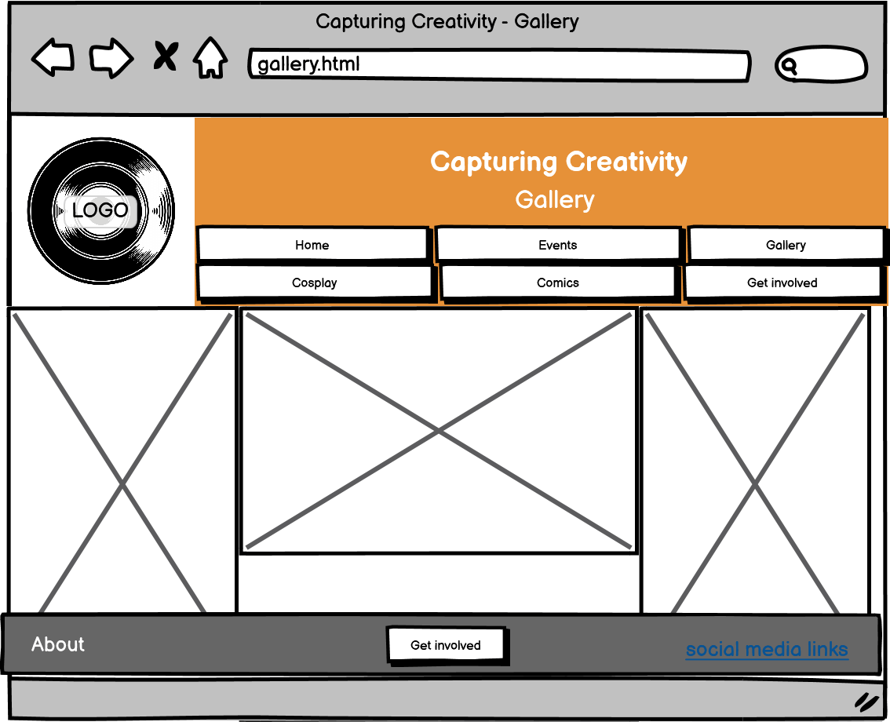
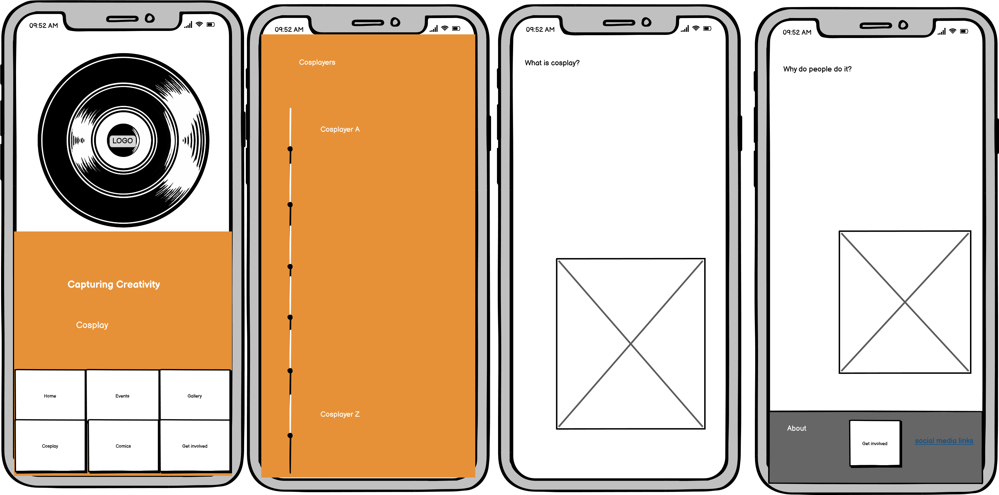
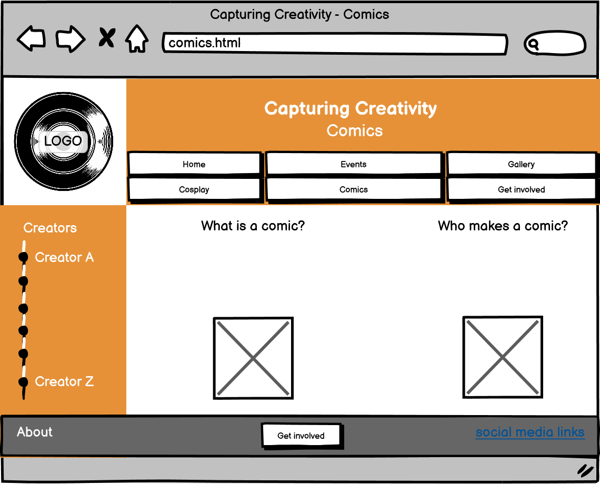
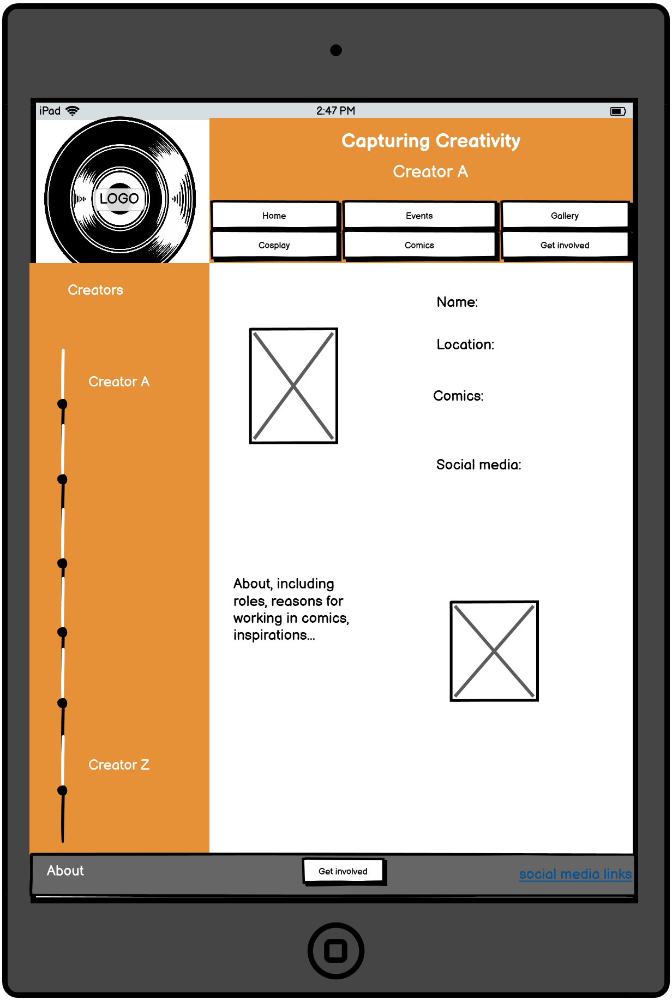
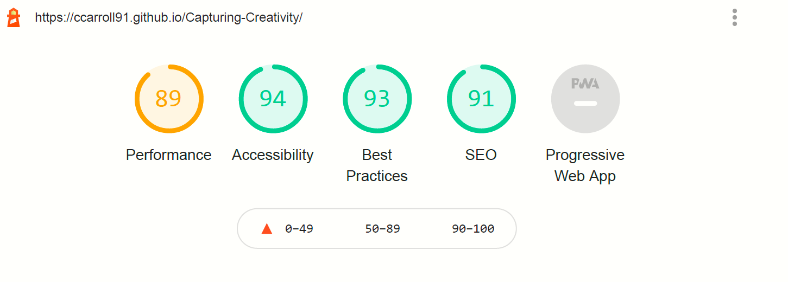
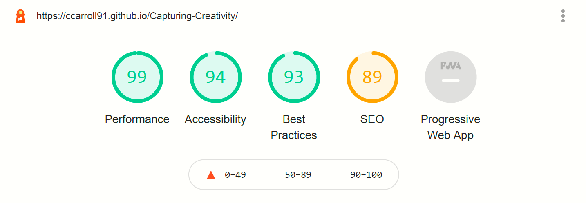

# Capturing Creativity

This site was designed with the expresss purpose of promoting the Irish convention scene, the events 
that take place throughout the year, and the people that make it so special. 

The site (should it operate with more than dummy profiles) would serve to highlight and celebrate 
cosplayers, bring attention to the small press (non-professional comic books) section of Ireland, 
and alert people of all ages and interests about te major conventions taking place during the calender year. 

---

## Website Preview

##### Home

---

## Design Choices

### Layout

The layout for this site was inspired by the rough rule of thirds display option.
Breaking the page into this format allows for easier navigation and better UX, 
especially given the potential number of pages. The need to be able to jump between
hosted profiles while not taking away from the overall look of the site was easily
acheived by using this layout. 

#### Layout - Wireframes

##### Home

##### Events

##### Gallery

##### Cosplay

##### Cosplay Profile

##### Comics
Later renamed "Creators"

##### Creators Profile

##### Get Involved

#### Colours

As can be seen in the wireframes, the first colour pallet used an orange.
The accessibility based off similar colours on the wireframes were not promising.
[Material.io](https://material.io/resources/color/#!/?view.left=1&view.right=1&primary.color=c66625)

This was switched to a red during building, which despite strong accessibility was not 
in the original plan.
[Material.io](https://material.io/resources/color/#!/?view.left=1&view.right=1&primary.color=c62828)

A switch back to the original plan, coupled with a dark grey for the seconday colour, would work
provided that opacity levels were not tampered with.
[Material.io](https://material.io/resources/color/#!/?view.left=1&view.right=1&primary.color=c5520f)

A Lighthouse test in the Chrome Developer tools highlighted a potential visibility issue with #c5520f.
A switch to #a64100 has been implemented.

[Material.io](https://material.io/resources/color/#!/?view.left=1&view.right=1&primary.color=a54100&secondary.color=757575)

---

## Issues / Testing

### Icons - Font Awesome

Initial coding issues with FA icons was a syntax error. While the 
code on the site for importing was listed as below, 

<i class=" fas fa-home" aria-hidden="true"></i>

While this is looks like the correct code, having been sourced directly from FA, 
the formatting was incorrect, and the icons did not appear. Instead, this simple
fix was made:

<i class=" fa fa-home" aria-hidden="true"></i>

---

### Logo Placement

My initial logo placement was done inside of a <i>div</i> element, as below.

           header class="row no-gutters"
		        div class="col-md-4 logo" href="index.html"
		            div class="col-md-8"
		                div class="row no-gutters bg-color-cc-page"
		                    div class="col heading"

This was rectified, with the logo placed in an anchor to be a constant link 
to the Home page.

            header
                div class="row no-gutters"
                    a class="col-md-4 logo" href="index.html"
                       /a
                        div class="col-md-8"
                            div class="row no-gutters bg-color-cc-page"
                                div class="col heading"

### Profiles and page length - Cosplay and Creators

The first rendition of the page listed boilerplate profiles "Cosplayer A"-"Cosplayer Z"
in a timeline. The result was a page length that was annoying on a desktop, but downright 
impossible to navigate on a mobile device.

Two steps were taken:

1. The boilerplate names were replaced with fake profiles. While the information
on these profiles is largely the same (only one unique profile exists, Crafty Nathan's Creations)
they are linked to, and represent what the site *could* look like.

2. The site was futureproofed for growth by creating an alphabetical table to navigate
between the pages. This can be seen in both the Cosplay and Creators pages, and the profiles attached:

        <!----------------------------------------------Nav Table
                                    In the event that the page 
                                    grows to require division of 
                                    profiles, this table can be 
                                    uncommented and implemented at a 
                                    moment's notice, linking to two 
                                    near-identical pages for navigating 
                                    between profiles while maintaining the 
                                    overall look and lenght of 
                                    the page-->

                            <!--
                            <table class="table">
                                <thead>
                                    <tr>
                                        <th scope="col" class="left-style-bold">A - H</th>
                                        <th scope="col"><a href="cosplay2.html" class="link">I - P</a></th>
                                        <th scope="col"><a href="cosplay3.html" class="link">O - Z</a></th>
                                    </tr>
                                    </thead>
                                </table>      
                            --> 

    The table was created using Bootstrap.

### Images

Images were made resposive to screen sizes: 

        #circle-container-small{
		    Removed width: 260px;
		    Removed height: 260px;
		    Added min-width: 200px;
		    Added min-height: 200px;
		    Added height: 20vw;
		    Added width: 20vw;
		    padding:0;
		    border-style: solid;
		    border-color: #c62828;
	
		#circle-cosplay1{
		    background: url("../images/cosplay1.jpg") no-repeat center center;
		    height:100%;
		    Added width: 100%;
		    Added object-fit: cover;
		    border-radius: 50%;
		}

### index

The issues with the index.html page lenght were persistent. My initial response was to 
use br tags to space out the page and force the overall lenght of the page down. This was 
a reaction to the page falling short when viewed using the dev tools and an iPad.

This was remedied with a couple of steps.
- A style tag was attached to the Section
     
     style="min-height: calc(100vh-539px);"

  This style tag would take into account the Header and Footer (539px) and the 
  total view height of the page, forcing the lenght of the page down. 

- The section-column was adjusted to also include the vh tag

    
        .section-column {
            display: table-cell;
            padding: 0 30px 30px;
            float: none;
            height: calc(100vh-539px);
            }
    
This would result in the background colours extending the full length of the page.

---

## Roadmap

Future plans for this site include an expansion of the Creators aspect.

1. A preview page for up and coming books would help highlight the work that is being done in the 
background by some of the Creators. This would assist them in advertising their piece and hopefully get 
it into more hands. This page would be a simple
    
    - Title
    - Team
    - Release date
    - Blurb
    - Cover/promotional art

Similarily,

2. A comic book review page. This page would make the overall project feel like it had more integrity, 
and would allow its members a chance to shine and grow. This review page would offer Creators a chance 
to tell thier customers an unbiased opinion about their book.

    - The layout of these review pages would include the information seen in a preview, a progress bar 
chart (Art, Writing, Colours, Lettering, Overall), and a couple of paragraphs about the comic from a 
technical standpoint.

3. The form on the Get Involved page would have a destination. Currently the form does nothing.

---

## Contributing

Currently the page is not looking for further contribution, however, should that change in the future 
one would be required to follow certain steps when creating new material for the site.

- Index - No changes required
- Events - From the events page, one should copy the existing code listed events, and insert new 
events into the calender starting at January to at most 18 months ahead (this is to ensure that events 
early on in the calender year are not ignored or missed).
The *next event* should also be updated regularly, requiring a new Google Map link and About.
- Gallery - The Gallery page is open to the discretion of the site photographers, but each image 
should be at most 3000px (w/h) and should be run through https://tinypng.com/ to reduce the size 
of the image.
- Cosplay / Creators - The two locations share near identical code. A futureproofed line of code 
has been prewritten for both pages, and commented out. This code will change the current layout from an 
Aa-Zz list to an A - H | I - P | Q - Z (built using bootsrap) table menu. In the event that this code has to be 
implemented (growth) all profiles would need to be moved to the correct page alphabetically. Profile pages should 
always display the A - H section. This measure is to ensure the workload for creating a new profile does not 
become tedious.
- Get Involved - A destination for the form is required.

---

## Code Attribution

Initial layout of Rows and Columns sourced from Resume 
Mini-Project for rough rule of thirds. (Matt Rudge)

Changes were made to style and menus thereafter.

Circle layout responsive code sourced from this Stack Overflow page: 
[Stack Overflow](https://stackoverflow.com/questions/41570348/responsive-circle-and-image-fit-on-circle)

---

## Image Attribution

The images marked as "random 1-5 .jpg" were all sourced from a random face generator [https://thispersondoesnotexist.com/]

All other images were taken by/belong to the author of the site.

---

## Technology Used

1. HTML
2. CSS  
3. Bootstrap V4 (https://maxcdn.bootstrapcdn.com/bootstrap/4.2.1/css/bootstrap.min.css)
4. Gitpod / Github
5. Google Chrome Developer Tools

---

## Deployment

Steps used to create this site:

1. The index page was created, and styled.
2. The Header and Footer were reproduced across the site's various tabs.
3. Basic content was added to pages, including images.
4. The gallery wall was created.
5. The timeline objects were created using a "border-left" function
6. The form page was created, using Bootstrap form functions.
7. Various debugging measures were taken, using Google Chrome Developer tools.

This page is deployed using Github pages.

- The branch used is the *master* branch
- The folder used is *root*

In order to clone this repository:

1. Head over to https://github.com/ccarroll91/Capturing-Creativity
2. Find the **Code** button and click the down arrow
3. Usung the clipboard, you can "Clone with HTTPS"
4. Open Git Bash
5. Change your directory
6. git clone and *paste* the url
7. Press ENTER. The clone has been made.

---

## Acknowledgements

- Code institute lecturers
- Bootstrap
- Font Awesome
- https://tinypng.com/
- https://material.io/
- http://techsini.com/multi-mockup
- https://webformatter.com/html

---

## Lighthouse Reports

Mobile Report

Desktop Report

---

## Author

Conor Carroll