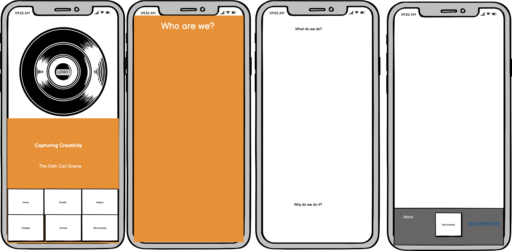
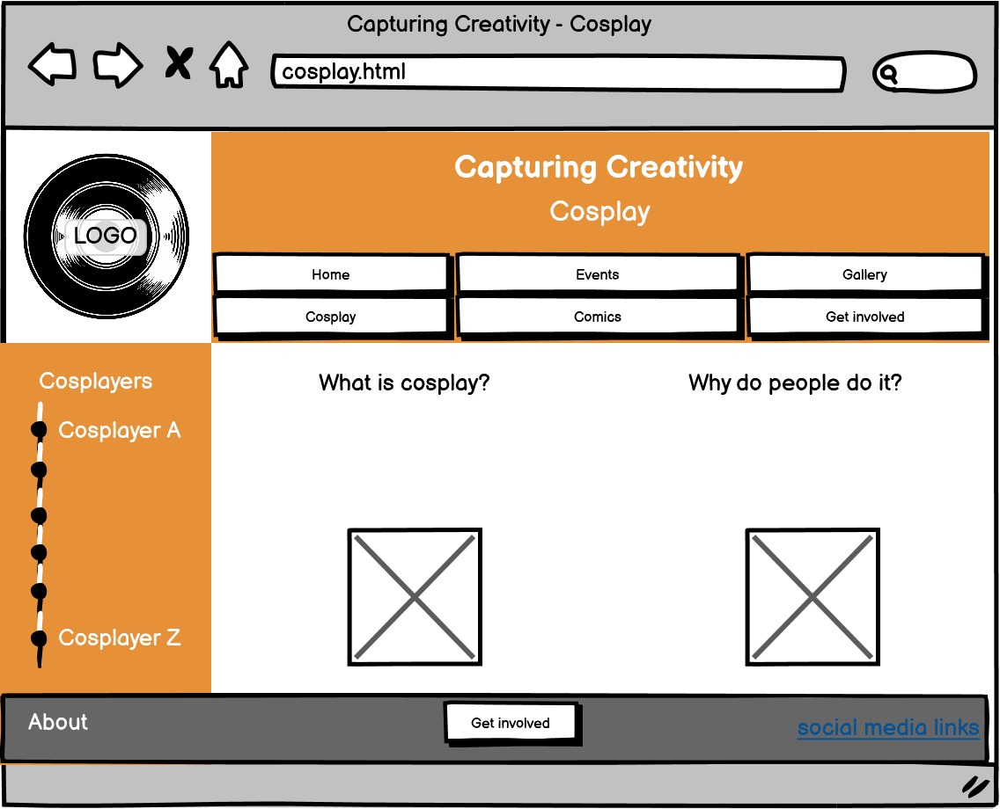
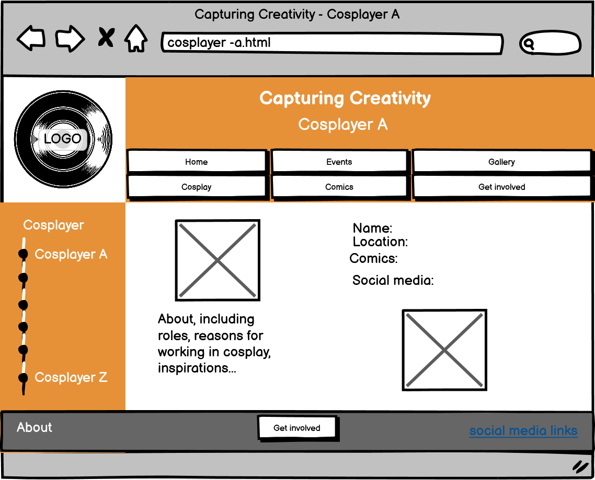
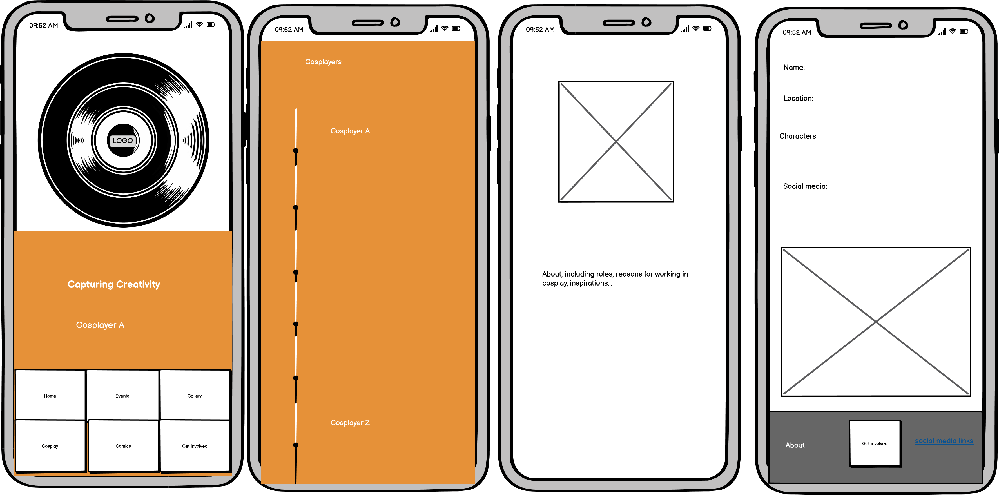
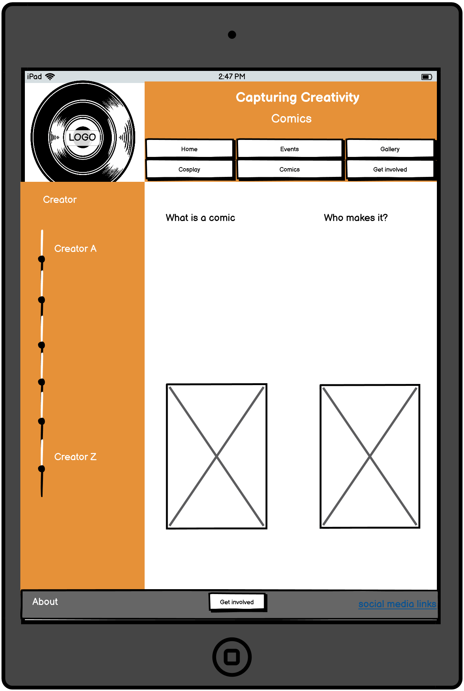

## Design Choices

### Layout

The layout for this site was inspired by the rough rule of thirds display option.
Breaking the page into this format allows for easier navigation and better UX, 
especially given the potential number of pages. The need to be able to jump between
hosted profiles while not taking away from the overall look of the site was easily
acheived by using this layout. 

#### Layout - Wireframes

##### Home

##### Events

##### Gallery

##### Cosplay

##### Cosplay Profile

##### Comics
Later renamed "Creators"

##### Creators Profile

##### Get Involved

#### Colours

As can be seen in the wireframes, the first colour pallet used an orange.
The accessibility based off similar colours on the wireframes were not promising.
[Material.io](https://material.io/resources/color/#!/?view.left=1&view.right=1&primary.color=c66625)

This was switched to a red during building, which despite strong accessibility was not 
in the original plan.
[Material.io](https://material.io/resources/color/#!/?view.left=1&view.right=1&primary.color=c62828)

A switch back to the original plan, coupled with a dark grey for the seconday colour, would work
provided that opacity levels were not tampered with.
[Material.io](https://material.io/resources/color/#!/?view.left=1&view.right=1&primary.color=c5520f)

## Issues

### Icons - Font Awesome

---

Initial coding issues with FA icons was a syntax error. While the 
code on the site for importing was listed as below, 

<i class=" fas fa-home" aria-hidden="true"></i>

While this is looks like the correct code, having been sourced directly from FA, 
the formatting was incorrect, and the icons did not appear. Instead, this simple
fix was made:

<i class=" fa fa-home" aria-hidden="true"></i>

---

### Logo Placement

---

My initial logo placement was done inside of a <i>div</i> element, as below.

           header class="row no-gutters"
		        div class="col-md-4 logo" href="index.html"
		            div class="col-md-8"
		                div class="row no-gutters bg-color-cc-page"
		                    div class="col heading"

This was rectified, with the logo placed in an anchor to be a constant link 
to the Home page.

            header
                div class="row no-gutters"
                    a class="col-md-4 logo" href="index.html"
                       /a
                        div class="col-md-8"
                            div class="row no-gutters bg-color-cc-page"
                                div class="col heading"

### Profiles and page length - Cosplay and Creators

The first rendition of the page listed boilerplate profiles "Cosplayer A"-"Cosplayer Z"
in a timeline. The result was a page length that was annoying on a desktop, but downright 
impossible to navigate on a mobile device.

Two steps were taken:

1. The boilerplate names were replaced with fake profiles. While the information
on these profiles is largely the same (only one unique profile exists, Crafty Nathan's Creations)
they are linked to, and represent what the site *could* look like.

2. The site was futureproofed for growth by creating an alphabetical table to navigate
between the pages. This can be seen in both the Cosplay and Creators pages, and the profiles attached:

        <!----------------------------------------------Nav Table
                                    In the event that the page 
                                    grows to require division of 
                                    profiles, this table can be 
                                    uncommented and implemented at a 
                                    moment's notice, linking to two 
                                    near-identical pages for navigating 
                                    between profiles while maintaining the 
                                    overall look and lenght of 
                                    the page-->

                            <!--
                            <table class="table">
                                <thead>
                                    <tr>
                                        <th scope="col" class="left-style-bold">A - H</th>
                                        <th scope="col"><a href="cosplay2.html" class="link">I - P</a></th>
                                        <th scope="col"><a href="cosplay3.html" class="link">O - Z</a></th>
                                    </tr>
                                    </thead>
                                </table>      
                            --> 

    The table was created using Bootstrap.

### Images

Images were made resposive to screen sizes: 

        #circle-container-small{
		    Removed width: 260px;
		    Removed height: 260px;
		    Added min-width: 200px;
		    Added min-height: 200px;
		    Added height: 20vw;
		    Added width: 20vw;
		    padding:0;
		    border-style: solid;
		    border-color: #c62828;
	
		#circle-cosplay1{
		    background: url("../images/cosplay1.jpg") no-repeat center center;
		    height:100%;
		    Added width: 100%;
		    Added object-fit: cover;
		    border-radius: 50%;
		}

### index

The issues with the index.html page lenght were persistent. My initial response was to 
use br tags to space out the page and force the overall lenght of the page down. This was 
a reaction to the page falling short when viewed using the dev tools and an iPad.

This was remedied with a couple of steps.
- A style tag was attached to the Section
     
     style="min-height: calc(100vh-539px);"

  This style tag would take into account the Header and Footer (539px) and the 
  total view height of the page, forcing the lenght of the page down. 

- The section-column was adjusted to also include the vh tag

    
        .section-column {
            display: table-cell;
            padding: 0 30px 30px;
            float: none;
            height: 100vh;
            }
    
This would result in the background colours extending the full length of the page.

## Code Attribution

Initial layout of Rows and Columns sourced from Resume 
Mini-Project for rough rule of thirds. (Matt Rudge)

Changes were made to style and menus thereafter.

---

Circle layout responsive code sourced from this Stack Overflow page: 
[Stack Overflow](https://stackoverflow.com/questions/41570348/responsive-circle-and-image-fit-on-circle)

